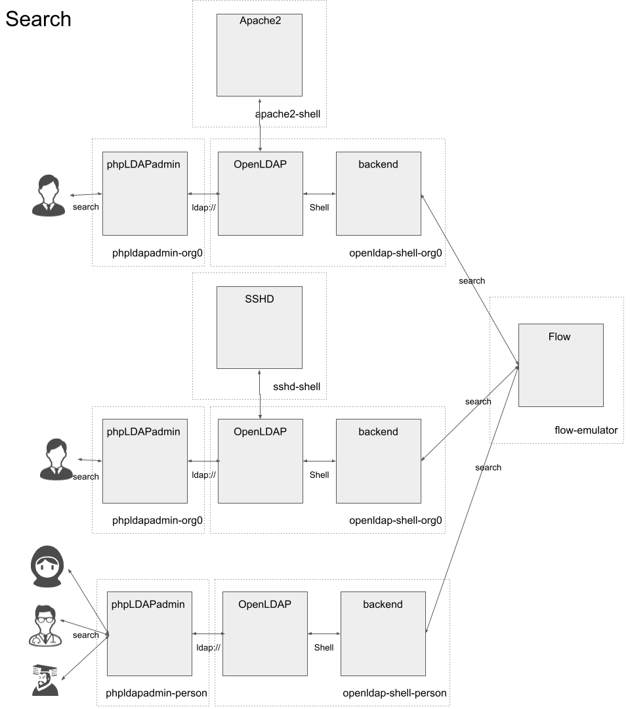
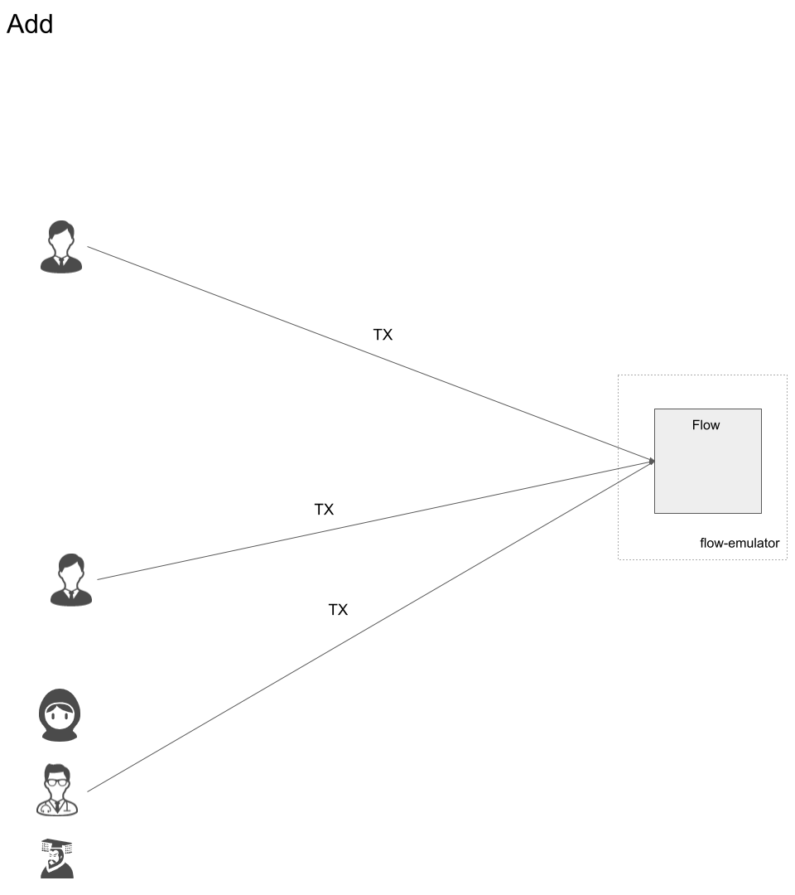
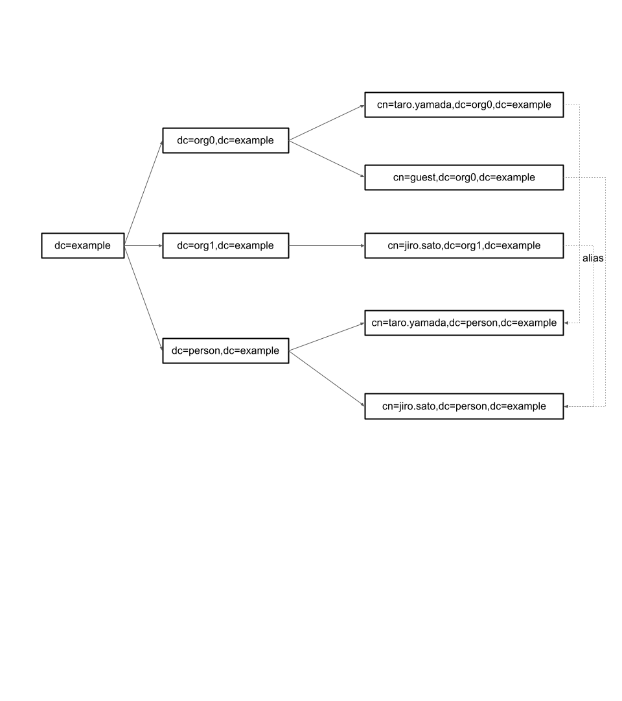
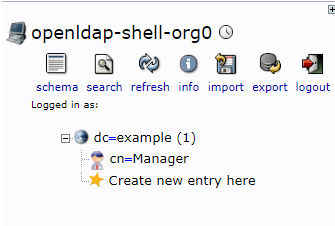
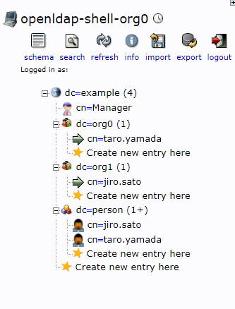
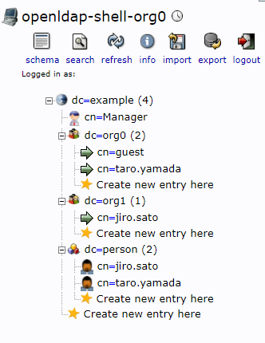

## 概要

本プロジェクトはDIDおよびSBTの観点から自分の情報を自分で管理するのを支援することを目的とする。
また、既存の技術を拡張することで緩やかにレガシーなネットワークとブロックチェーンを接続することが目標である。

## 背景

上記の目的・目標を達成するため、本プロジェクトでは企業内ネットワークで頻繁に使用されるLDAPに注目した。
LDAPはディレクトリサービスで、レガシーな企業内ネットワークのサービスの認証等に使用される。
あらゆる機器・サーバがLDAP対応している現状を鑑みると、LDAPのインターフェースをにしたがうことで企業内ネットワークに手を加えることなく拡張が可能となる。

特に、本プロジェクトではOpenLDAPにおいてバックエンドDBが変更可能である点に注目し、これをFlowデータベースに置き換えた。
バックエンドDBがブロックチェーンになることで、ユーザーは自分自身のエントリの管理は自分で行う事ができる。
勤務先企業はそのエントリへのエイリアスを作成することで企業内ネットワークへのアクセスを許可することができる。
また、一時的に他社のプロジェクトに参画する際は、その会社が一時的にエイリアスを作成することでアクセスを許可することも可能である。

本プロジェクトでは以下の機能を実装した。

- Flowブロックチェーン用コントラクト
- Flowブロックチェーンへの書き込みトランザクション
- Searchクエリに対するFlowブロックチェーン検索
- エイリアスのサポート
- 自身の配下にないDNへの書き込み禁止

Cadence言語がリソース志向型であることからFlowブロックチェーンを採用した。これにより、自分自身で自分のエントリをリソースとして管理することが実現できた。


## プロジェクト構成

- backend: OpenLDAPのSearchコマンドを解釈し、Flowブロックチェーンのコントラクトから該当エントリを検索
- cadence: Flowブロックチェーンにデプロイされるコントラクトおよびエントリ作成のためのトランザクション
- docker: デモ環境構築のためのDockerファイルおよびdocker-composeファイル群


## モジュール構成

### エントリの検索

通常通りOpenLDAP経由で行われる。
この際、管理アカウント(cn=Manager,dc=example)はBackend内部のローカルストレージに保存されたものを参照するが、それ以外はすべてFlowブロックチェーンに保存されたものを参照する。




### エントリの追加
Flowブロックチェーンにトランザクションを発行することで実施される。すなわち、自身のエントリを作成する際に自身の管理する秘密鍵を使用する。これにより、自身の情報は自身で管理するという要件を満たすことができる。




## デモ環境

### DIT (Directory Information Tree)



`dc=example`がルートである。`dc=person,dc=example`以下に各個人が自身のエントリを自身の秘密鍵を用いて作成する。
企業は`dc=org0,dc=example`、`dc=org1,dc=example`の２個が存在する。
それぞれ、`taro.yamada`、`jiro.sato`を雇用したため、エイリアスを作成して紐づける。
さらに`jiro.sato`は`guest`として`org0`へのアクセスも持つ。


### デモ実行方法
1. dockerディレクトリに移動し、docker composeを実行
```
% cd docker
% docker-compose up
```

2. ブラウザで https://localhost:7443 にアクセス（証明書の警告は無視）
3. phpLDAPadmin左側のメニューが `openldap-shell-org0` になっていることを確認
4. 直下の `login` をクリック
5. `Login DN:` に `dc=example`、`Password`に`admin0`を入力しログイン
6. 以下のようになっていることを確認



7. `flow-emulator` コンテナにログイン
```
% docker exec -it flow-emulator /bin/bash
# cd /cadence
```

8. 今後使用するFlowアカウントを作成
```
# ./test/setup.sh
```

9. 以下、トランザクションを発行してエントリを作成
```
# ./test/add_org_entry.sh
# ./test/add_user_entry.sh
# ./test/add_alias.sh
```

10. この段階で以下のように`org0`は`taro.yamada`へのエイリアス、`org1`は`jiro.sato`へのエイリアスを持つ



11. ブラウザで http://localhost:8081/internal にアクセス
12. Basic認証ダイアログで`Username: taro.yamada`、`Password: taro`でログインできることを確認。また、`Username: jiro.sato、Password: jiro`でログイン出来ないことを確認
13. PC上のターミナルからsshの挙動を確認（taro.yamada@localhost / taroでログイン出来ないことも確認）
```
% ssh -p 8022 jiro.sato@localhost
jiro.sato@localhost's password: <-jiroを入力
jiro.sato@0721a2b3046f:/$
```

14. `flow-emulator` コンテナで以下を実行。`org0`に`guest`が追加されていることを確認
```
# ./test/add_guest.sh
```



15. `guest`は`jiro.sato`へのエイリアスなので、ブラウザでhttp://localhost:8081/internal にアクセスし、`jiro.sato`でログインできることを確認

16. `flow-emulator` コンテナで以下を実行。トランザクションが失敗していることを確認。これは自身のDNとは別の場所にエントリを作成しようとしたため発生したエラー。
```
# ./test/fail_to_add_guest.sh
```